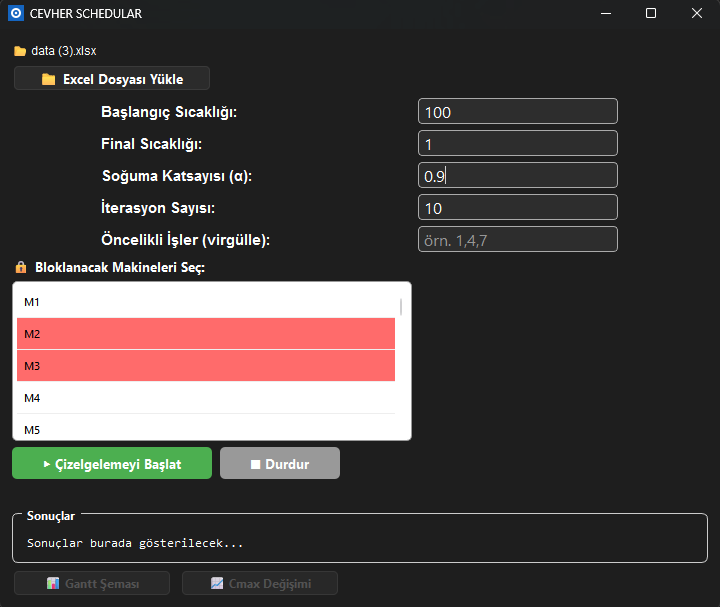
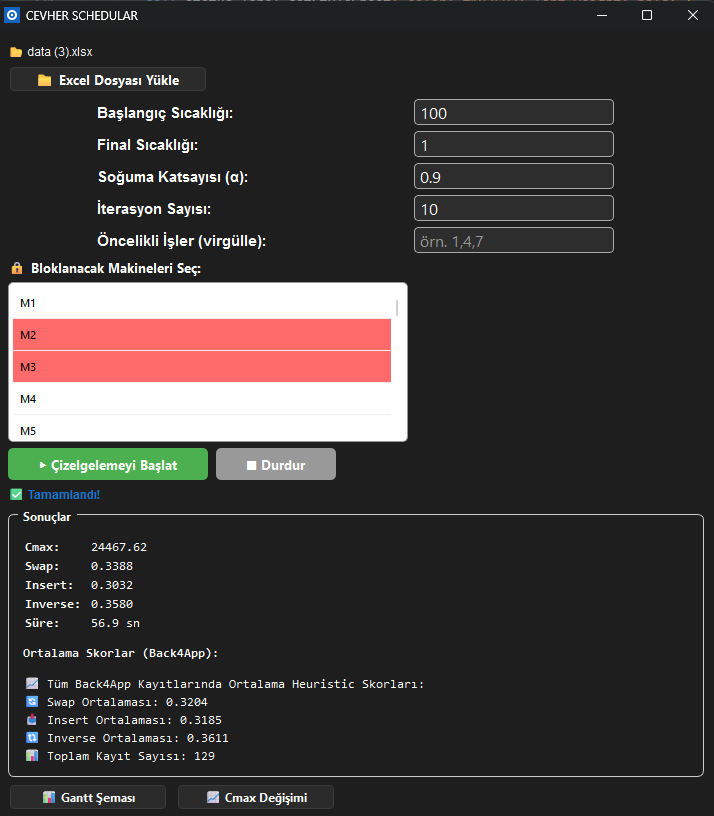
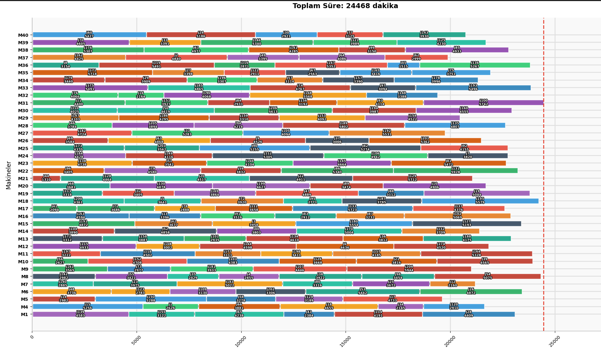
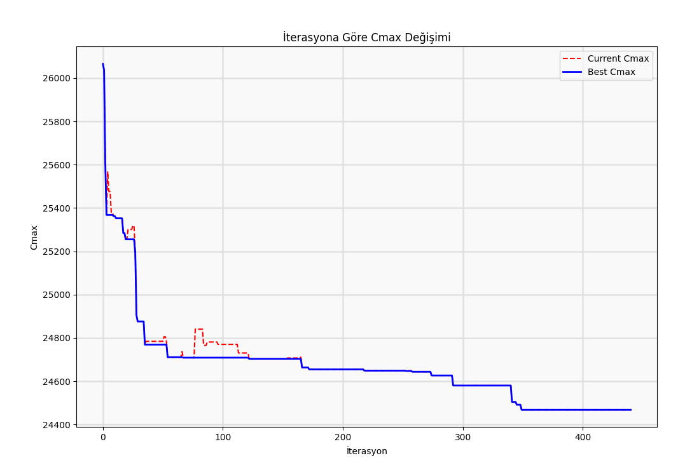

# Cevher Üretim Çizelgeleme (Parallel Machine Scheduling) Uygulaması

🌍 *[English Version of README](README_EN.md)*

Bu proje, bir fabrikadaki makine ve iş sıralamasını optimize etmek için **Tavlama Benzetimi (Simulated Annealing)** algoritmasını kullanan PyQt6 tabanlı masaüstü bir uygulamadır. Veriler bulut tabanlı Back4App veritabanına kaydedilir ve sonuçlar interaktif bir Gantt Şeması ile görselleştirilir.

## 📌 Projenin Amacı ve Çalışma Akışı
Bu uygulamanın temel amacı, karmaşık üretim hatlarındaki beklemeleri, geçiş kayıplarını ve makine boşluklarını en aza indirmektir. Program şu adımlarla çalışır:
1. **Veri Yükleme:** İş süreleri, sipariş miktarları ve makineler arası kurulum (setup) süreleri Excel dosyalarından okunur.
2. **Optimizasyon (Çizelgeleme):** Tavlama Benzetimi algoritması, binlerce farklı iş sıralaması senaryosunu hızlıca deneyerek üretimin en kısa sürede bitmesini (Makespan / $C_{max}$) sağlayacak sıralamayı saniyeler içinde bulur.
3. **Bulut Senkronizasyonu:** Bulunan en iyi sonuçlar ve algoritmanın performans geçmişi otomatik olarak bulut veritabanına (Back4App) aktarılır.
4. **Görsel Raporlama:** Elde edilen optimum üretim planı, operatörlerin ve planlama mühendislerinin anlayabileceği detaylı bir zaman çizelgesi (Gantt Şeması) üzerinde interaktif olarak gösterilir.

## 📖 Projenin Hikayesi ve Gelişmiş Algoritma Yapısı
Gerçek dünyadaki üretim ortamları oldukça karmaşıktır. Bu projede, klasik çizelgeleme problemlerinden farklı olarak şu zorluklar ele alınmıştır:
- **Makine Kısıtları:** Her iş, her makinede işlenemez.
- **Değişken Parametreler:** Rastgele siparişler, farklı çevrim süreleri ve makineler arası değişken kurulum (setup) süreleri aktiftir.

Bu dinamik yapıdaki problemi çözmek için **Tavlama Benzetimi (Simulated Annealing)** algoritmasını pürüzsüz bir **Hiper-Sezgisel (Hyper-heuristic)** yaklaşımla destekledik:
- Algoritma çalışırken komşuluk üretmek için **Swap (Değiştirme), Insert (Araya Ekleme) ve Inverse (Ters Çevirme)** yöntemlerini kullanır.
- Her iterasyonda başarılı (daha iyi bir Makespan üreten) bir yöntem **ödüllendirilirken**, başarısız olan yöntem **cezalandırılır.** 
- Yöntemlerin kazandığı bu ödül/ceza puanları **merkezi bir bulut veritabanına (Back4App)** yüklenir. Bulut altyapısının tercih edilmesindeki asıl amaç; **farklı fabrikalardaki veya birimlerdeki kullanıcıların çalıştırdığı algoritmaların tek bir sistemi kümülatif olarak eğitebilmesidir.** Gelecekteki çalışmalarda bu evrensel veri havuzundan çekilen ortalama puanlar kullanılarak, problemin doğasına en uygun yöntemlerin matematiksel olasılıkla daha sık seçilmesi sağlanır ve böylece algoritma global bir tecrübeyle "öğrenerek" daha akıllı sonuçlar üretir.

## 🚀 Özellikler

- **Tavlama Benzetimi Algoritması**: Optimum üretim sıralamasını bularak toplam tamamlanma süresini (Makespan / $C_{max}$) en aza indirir.
- **Kullanıcı Dostu UI**: PyQt6 ve QThread kullanılarak, arayüz donmadan işlem sırasında ilerleme (progress bar) gösterilir.
- **Veri Görselleştirme**: Matplotlib entegrasyonu sayesinde interaktif Gantt Şeması üzerinden işlerin hangi makinede, saat kaçta ve ne kadar sürede üretileceği detaylıca gösterilir.
- **Bulut Veritabanı**: Çözüm sonuçları Back4App (Parse) altyapısı kullanılarak buluta yedeklenir.

## 📸 Ekran Görüntüleri

| Ana Yükleme Ekranı | Optimizasyon (Çalışma Tablosu) |
|:---:|:---:|
|  |  |

| İnteraktif Gantt Şeması | İterasyon Gelişim Grafiği (Makespan) |
|:---:|:---:|
|  |  |

## 📦 Kurulum ve Çalıştırma

### 1. Gereksinimleri Yükleyin
Bu projeyi çalıştırmak için bilgisayarınızda Python yüklü olmalıdır. Kütüphaneleri kurmak için:
```bash
pip install pandas numpy matplotlib PyQt6 python-dotenv requests
```

### 2. Ortam Değişkenlerini (API) Ayarlayın
Bulut (Back4App) veritabanı bağlantısı için API anahtarlarına ihtiyacınız var:
1. Proje ana dizininde bulunan `.env.example` dosyasının adını `.env` olarak değiştirin.
2. İçerisine kendi Back4App `Application ID` ve `REST API Key` bilgilerinizi yapıştırın.

### 3. Uygulamayı Başlatın
Aynı klasörde veri dosyalarının (`A_Z.xlsx`, `K_M.xlsx`, `M_Z.xlsx` vb.) bulunduğundan emin olun. Ardından ana uygulamayı çalıştırın:
```bash
python app_github.py
```

## 🛠 Kullanılan Teknolojiler
- **Python 3.12**
- **PyQt6**: Grafik Kullanıcı Arayüzü (GUI)
- **Matplotlib**: Gantt şeması ve sonuç grafikleri çizimi
- **Pandas & Numpy**: Excel okuma ve veri işleme
- **Tavlama Benzetimi**: Optimizasyon algoritması
- **Back4App (REST API)**: Veri kaydetme

## 🔒 Güvenlik Uyarıları
**ÖNEMLİ:** Gerçek API anahtarlarınızın bulunduğu `.env` dosyasını ASLA GitHub profilinize yüklemeyin. Bu projede hali hazırda `.gitignore` ayarları yapılmış durumdadır.
